# 🌱 Projeto: Etapas de uma Máquina Agrícola — Fase 3

**Nome do Grupo:** IA 2/2025  
**Integrantes:**  
- Gustavo Redoan  
- Jorge Macedo  
- Lucca Benigno  

---

## 📘 Sumário

1. [Introdução](#introducao)  
2. [Objetivo](#objetivo)  
3. [Estrutura do Projeto](#estrutura-do-projeto)  
4. [Passo a Passo – Importação no Oracle](#passo-a-passo-importacao)  
5. [Carga de Dados no Oracle](#carga-de-dados)  
6. [Consultas SQL](#consultas-sql)  
7. [Resultados](#resultados)  
8. [Conclusão](#conclusao)  
9. [Licença](#licenca)

---

## 1. Introdução <a name="introducao"></a>

Esta atividade tem como objetivo importar e analisar, no **Oracle SQL Developer**, os dados coletados pelos sensores do sistema de irrigação inteligente.  
O processo envolveu a criação da tabela **SENSORES**, configuração de tipos de dados e execução de consultas SQL para apoiar a análise de **umidade**, **pH** e **estado do solo**, consolidando o uso de banco de dados.

---

## 2. Objetivo <a name="objetivo"></a>

O objetivo desta atividade foi **carregar os dados coletados pelos sensores da Fase 2** dentro de um banco de dados **Oracle**, realizar **consultas SQL** e documentar todo o processo no **GitHub**, promovendo boas práticas de versionamento e organização técnica.

---

## 3. Estrutura do Projeto <a name="estrutura-do-projeto"></a>

```plaintext
.
└── projetos-faculdade
    ├── assets
    │   ├── fase-3-cap-1-etapas-maquina-agricola-0.png
    │   ├── fase-3-cap-1-etapas-maquina-agricola-1.png
    │   ├── fase-3-cap-1-etapas-maquina-agricola-2.png
    │   ├── fase-3-cap-1-etapas-maquina-agricola-3.png
    │   ├── fase-3-cap-1-etapas-maquina-agricola-4.png
    │   ├── fase-3-cap-1-etapas-maquina-agricola-5.png
    │   ├── fase-3-cap-1-etapas-maquina-agricola-query-0.png
    │   ├── fase-3-cap-1-etapas-maquina-agricola-query-1.png
    │   ├── fase-3-cap-1-etapas-maquina-agricola-query-2.png
    │   ├── fase-3-cap-1-etapas-maquina-agricola-query-3.png
    │   ├── fase-3-cap-1-etapas-maquina-agricola-query-4.png
    │   └── fase-3-cap-1-etapas-maquina-agricola-query-5.png
    │
    ├── data
    │   └── fase-3-colheita-dados-insights
    │       └── cap-1-etapas-maquina-agricola
    │           └── Sensores_fazenda.txt
    │
    ├── docs
    │   └── fase-3-colheita-dados-insights
    │       └── cap-1-etapas-maquina-agricola
    │           └── README.md
    │
    ├── src
    │   └── fase-3-colheita-dados-insights
    │       └── cap-1-etapas-maquina-agricola
    │           └── consultasSQL.txt
    │
    └── README.md
```

---

## 4. Passo a Passo – Importação no Oracle <a name="passo-a-passo-importacao"></a>

### Etapa 1 – Início da Importação

No **Oracle SQL Developer**, clique com o botão direito sobre a conexão desejada (ex: *FiapDevelopment*) → selecione **"Tabelas" → "Importar Dados"**.

<p align="center">
  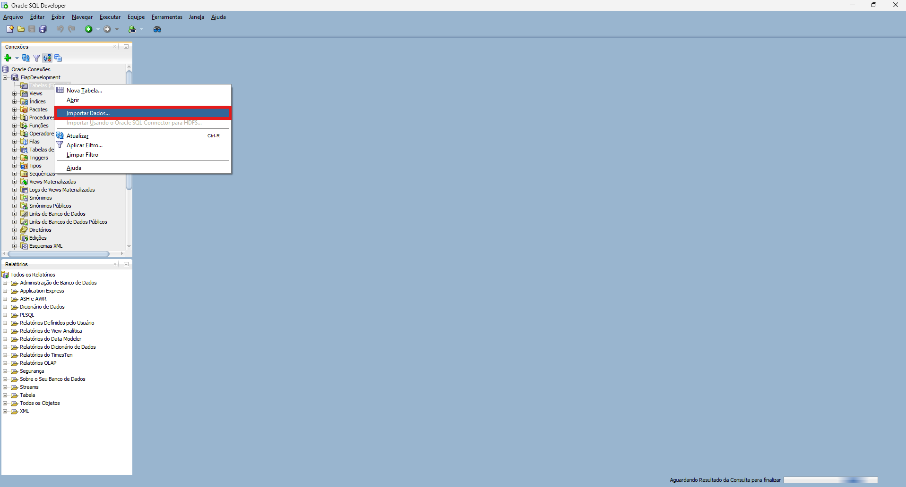
</p>

---

### Etapa 2 – Seleção do Arquivo

- Escolha o arquivo de origem: **./data/fase-3-colheita-dados-insights/cap-1-etapas-maquina-agricola/Sensores_fazenda.csv**  
- Codificação: UTF-8  
- Delimitador: `;`  
- Cabeçalho: Sim

<p align="center">
  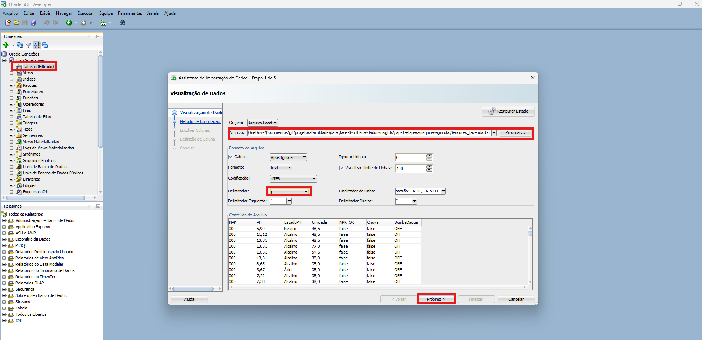
</p>

---

### Etapa 3 – Configuração da Tabela

- Método de Importação: **Inserir**  
- Nome da Tabela: **SENSORES**

<p align="center">
  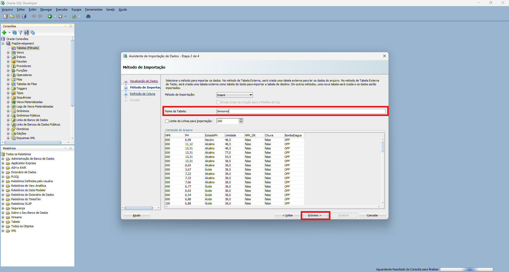
</p>

---

### Etapa 4 – Escolha de Colunas

Confirme as colunas que serão importadas:  
`NPK`, `PH`, `EstadoPH`, `Umidade`, `NPK_OK`, `Chuva`, `BombaDagua`

<p align="center">
  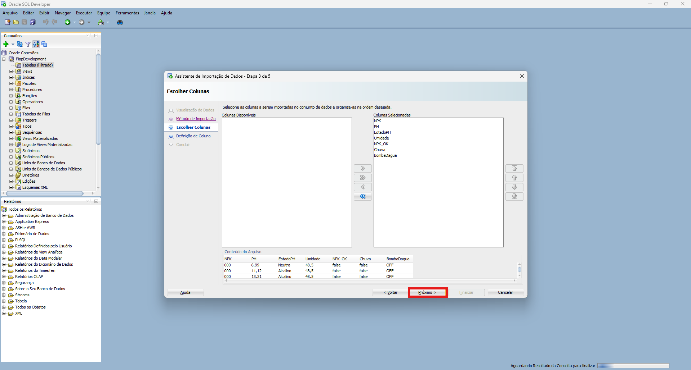
</p>

---

### Etapa 5 – Definição de Tipos de Dados

| Coluna     | Tipo de Dado | Observação        |
|-------------|--------------|-------------------|
| NPK         | VARCHAR2(25) | Valores numéricos |
| PH          | VARCHAR2(25) | Valores decimais  |
| EstadoPH    | VARCHAR2(50) | Texto             |
| Umidade     | NUMBER(5,2)  | Numérico          |
| NPK_OK      | BOOLEAN      | Verdadeiro/Falso  |
| Chuva       | VARCHAR2(10) | ON/OFF            |
| BombaDagua  | VARCHAR2(10) | ON/OFF            |

<p align="center">
  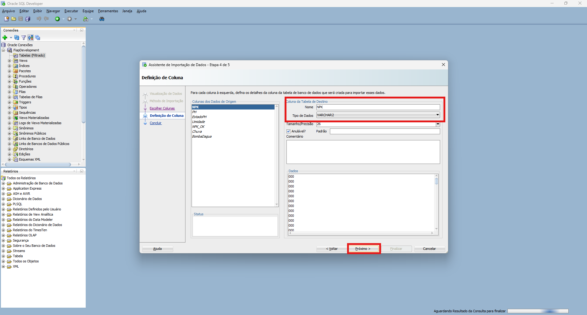
</p>

---

### Etapa 6 – Conclusão da Importação

Clique em **Finalizar** para criar a tabela e inserir os dados.

<p align="center">
  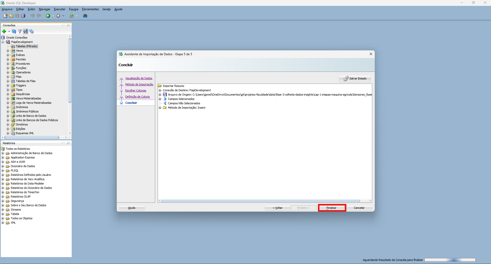
</p>

---

## 5. Carga de Dados no Oracle <a name="carga-de-dados"></a>

Após a importação, os dados da tabela **SENSORES** foram carregados com sucesso.

**Evidência de consulta:**  
```sql
SELECT * FROM SENSORES;
```

<p align="center">
  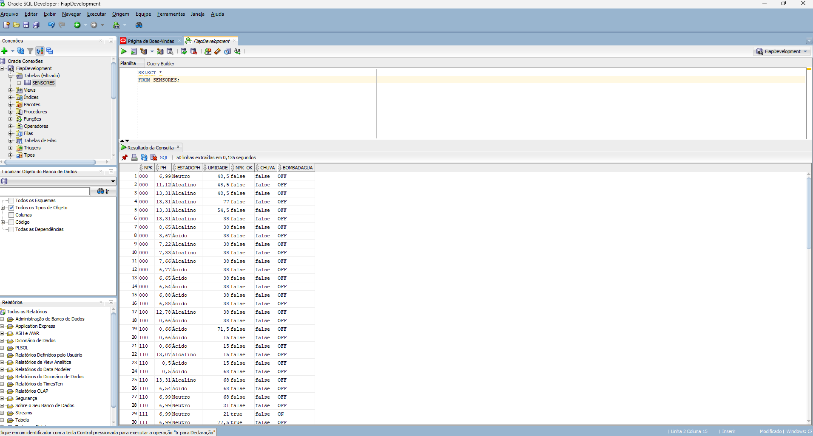
</p>

---

## 6. Consultas SQL <a name="consultas-sql"></a>

A seguir, as principais consultas realizadas no **Oracle SQL Developer**:

### a) Conta o número total de leituras registradas na tabela.
```sql
SELECT COUNT(*) AS total_leituras
FROM SENSORES;
```
<p align="center">
  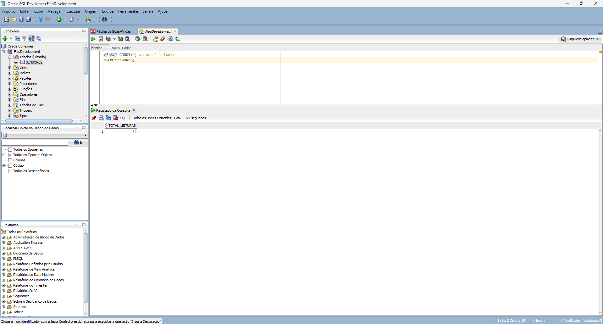
</p>

### b) Seleciona NPK, PH e Umidade para registros com pH 'Neutro' e umidade > 15.0.
```sql
SELECT NPK, PH, Umidade
FROM SENSORES
WHERE EstadoPH = 'Neutro' AND Umidade > 15.0;
```
<p align="center">
  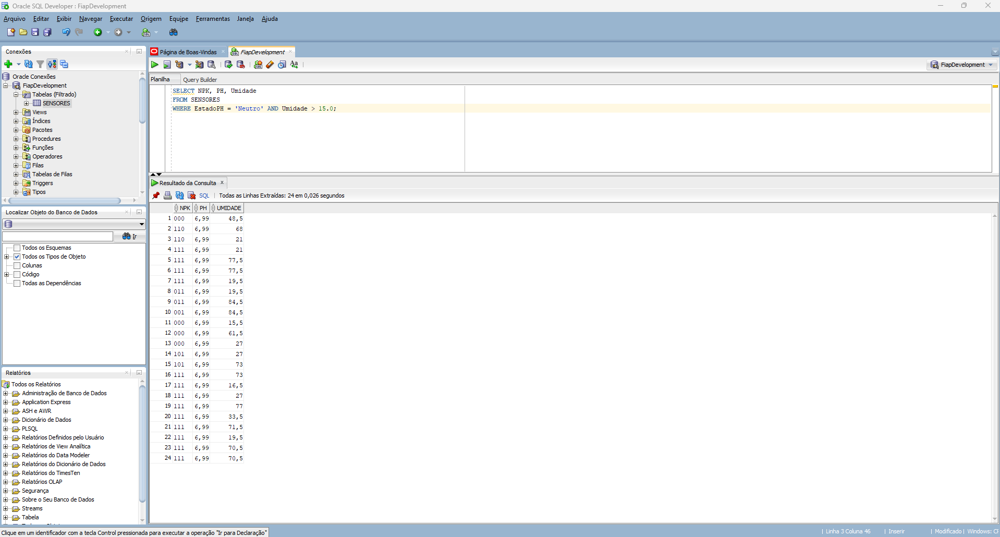
</p>

### c) Calcula a média da coluna Umidade em toda a tabela.
```sql
SELECT AVG(Umidade) as media_umidade
FROM SENSORES;
```
<p align="center">
  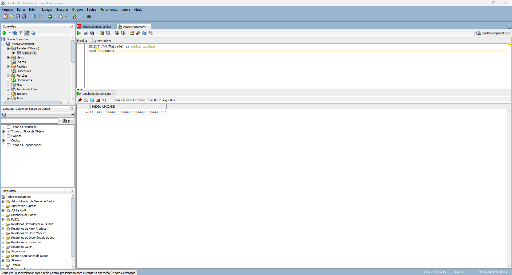
</p>

### d) Recupera todos os registros ordenados pelo valor de PH em ordem decrescente.
```sql
SELECT *
FROM SENSORES
ORDER BY PH DESC;
```
<p align="center">
  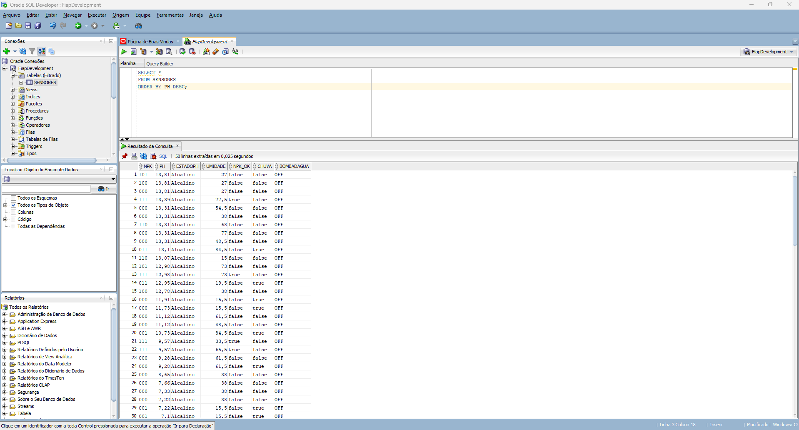
</p>

### e) Retorna valores extremos: maior e menor PH e maior e menor Umidade.
```sql
SELECT 
    MAX(PH) as ph_maximo,
    MIN(PH) as ph_minimo,
    MAX(Umidade) as umidade_maxima,
    MIN(Umidade) as umidade_minima
FROM SENSORES;
```
<p align="center">
  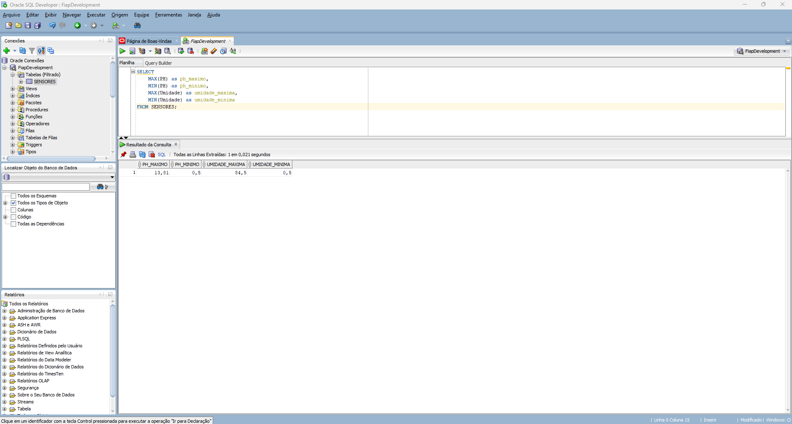
</p>

### f) Agrupa por EstadoPH e calcula a média de PH e a contagem de leituras para cada grupo.
```sql
SELECT 
    EstadoPH,
    AVG(PH) as media_ph,
    COUNT(*) as total_leituras
FROM SENSORES
GROUP BY EstadoPH;
```
<p align="center">
  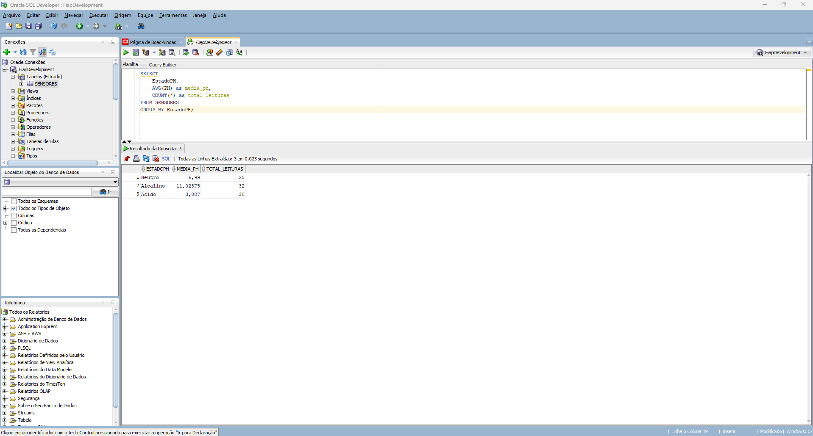
</p>

---

## 7. Resultados <a name="resultados"></a>

As consultas mostraram que:  
- O total de leituras armazenadas foi de **87 registros**.  
- Os valores de **umidade média** e **pH** variam de acordo com o estado químico do solo.  
- O dataset representa medições de **NPK**, **pH**, **umidade** e status dos sensores (**bomba** e **chuva**) coletadas na **Fase 2**.

---

## 8. Conclusão <a name="conclusao"></a>

O processo de importação e análise SQL foi **concluído com sucesso**. Os dados do arquivo **Sensores_fazenda.txt** foram carregados no banco **Oracle**, permitindo realizar consultas, filtragens e estatísticas básicas para apoiar a **gestão inteligente de irrigação** e a **análise da qualidade do solo**.

---

## 9. Licença <a name="licenca"></a>

📄 Este projeto é de uso educacional e livre, podendo ser adaptado conforme as necessidades acadêmicas ou pessoais dos autores.
